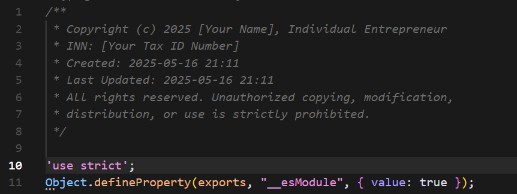

# Copyright Notice Generator

[](https://marketplace.visualstudio.com/items?itemName=bivex.copyright-notice)
[](https://marketplace.visualstudio.com/items?itemName=bivex.copyright-notice)
[](https://marketplace.visualstudio.com/items?itemName=bivex.copyright-notice)

Automatically add customizable copyright notices to your code files across multiple programming languages. Perfect for ensuring proper intellectual property protection in your projects.



## Key Features

- ✨ **Automatic Insertion**: Adds copyright notice when typing in a new file
- 🔄 **Manual Command**: Apply notice on demand with the Command Palette
- 😀 **Emoji Removal**: Remove all emojis from files with a single command
- 🌐 **Multi-language Support**: Works with all programming languages
- 📝 **Customizable Templates**: Use your own copyright text with dynamic year insertion
- 🕒 **Timestamp Support**: Include creation date and time in your notices
- 🔄 **Update Time Tracking**: Automatically updates the "last modified" timestamp
- 🔍 **Smart Detection**: Avoids duplicate notices
- 🧩 **File Extension Filtering**: Target specific file types

## How It Works

While you are typing, this extension checks if there's a copyright notice at the beginning of the file. If not, it adds one automatically based on your custom template.

You can also manually trigger the extension by running the "Apply Copyright Notice" command from the Command Palette (Ctrl+Shift+P).

Additionally, you can remove all emojis from any file using the "Remove All Emojis from File" command. This is useful for cleaning up code that contains unwanted emoji characters.

## Configuration Options

- `copyright-notice.languages`: Languages that the extension will be activated for (default: all languages)
- `copyright-notice.fileExtensions`: File extensions to which the copyright notice will be applied (e.g., ['.js', '.ts', '.py']). Use ['*'] for all files.
- `copyright-notice.template`: Copyright notice template. Use {year} for the current year, {timestamp} for creation time, and {updatetime} for last update time.
- `copyright-notice.includeTimestamp`: Whether to include timestamp when the copyright notice was added (default: false).
- `copyright-notice.timestampFormat`: Format for the timestamp (default: "YYYY-MM-DD HH:mm:ss").
- `copyright-notice.includeUpdateTime`: Whether to include and update the "last updated" timestamp (default: false).
- `copyright-notice.updateTimeFormat`: Format for the update timestamp (default: "YYYY-MM-DD HH:mm:ss").
- `copyright-notice.autoRemoveEmojis`: Whether to automatically remove all emojis from files when they are saved (default: false).
- `copyright-notice.excludedFiles`: File patterns to exclude from copyright notices (e.g., ['*.json', '*.config.js']). Supports glob patterns.

## Example Settings

### JavaScript/TypeScript Development

```json
{
  "copyright-notice.languages": [
    "javascript", 
    "typescript"
  ],
  "copyright-notice.fileExtensions": [
    ".js",
    ".jsx",
    ".ts",
    ".tsx"
  ],
  "copyright-notice.template": "/**\n * Copyright (c) {year} Your Company Name\n * All rights reserved.\n */\n\n"
}
```

### With Creation and Update Timestamps

```json
{
  "copyright-notice.includeTimestamp": true,
  "copyright-notice.includeUpdateTime": true,
  "copyright-notice.template": "/**\n * Copyright (c) {year} Your Company Name\n * Created: {timestamp}\n * Last Updated: {updatetime}\n * All rights reserved.\n */\n\n"
}
```

### Custom Timestamp Formats

```json
{
  "copyright-notice.includeTimestamp": true,
  "copyright-notice.timestampFormat": "DD/MM/YYYY",
  "copyright-notice.template": "/**\n * Copyright (c) {year} Your Company Name\n * Date: {timestamp}\n * All rights reserved.\n */\n\n"
}
```

```json
{
  "copyright-notice.includeTimestamp": true,
  "copyright-notice.timestampFormat": "YYYY.MM.DD at HH:mm",
  "copyright-notice.template": "/**\n * Created on {timestamp}\n * Copyright (c) {year} Your Company Name\n * All rights reserved.\n */\n\n"
}
```

### C/C++ Development

```json
{
  "copyright-notice.languages": [
    "c",
    "cpp"
  ],
  "copyright-notice.fileExtensions": [
    ".c",
    ".cpp",
    ".h",
    ".hpp"
  ],
  "copyright-notice.template": "/**\n * Copyright (c) {year} Your Company Name\n * All rights reserved.\n */\n\n"
}
```

### Python Development

```json
{
  "copyright-notice.languages": [
    "python"
  ],
  "copyright-notice.fileExtensions": [
    ".py"
  ],
  "copyright-notice.template": "# Copyright (c) {year} Your Company Name\n# All rights reserved.\n\n"
}
```

### AutoHotkey Development (.ahk and .ahk2 files)

```json
{
  "copyright-notice.fileExtensions": [
    ".ahk",
    ".ahk2"
  ],
  "copyright-notice.excludedFiles": [
    "*.json",
    "*.config.js",
    "package.json"
  ],
  "copyright-notice.template": "/*\n * Copyright (c) {year} Your Company Name\n * All rights reserved.\n */\n\n"
}
```

**Note**: The extension now works with `.ahk2` files even if VS Code doesn't recognize the language ID. Simply add the file extension to the `fileExtensions` array.

### Individual Entrepreneur / Sole Proprietor

```json
{
  "copyright-notice.includeTimestamp": true,
  "copyright-notice.includeUpdateTime": true,
  "copyright-notice.template": "/**\n * Copyright (c) {year} [Your Name], Individual Entrepreneur\n * INN: [Your Tax ID Number]\n * Created: {timestamp}\n * Last Updated: {updatetime}\n * All rights reserved. Unauthorized copying, modification,\n * distribution, or use is strictly prohibited.\n */\n\n"
}
```

## Additional Template Examples

The extension comes with a variety of pre-configured templates for different scenarios, including:

- Corporate templates (standard and detailed)
- Individual templates (sole proprietor, freelancer)
- Open source license templates (MIT, GPL)
- Language-specific templates (Python, HTML, Shell)

See the [template-examples.json](https://github.com/bivex/bivex.copyright-notice-0.1.0/blob/main/template-examples.json) file for a complete list of examples that you can copy into your configuration.

## Why Use Copyright Notices?

Adding copyright notices to your source code:
- Establishes ownership of intellectual property
- Helps with licensing compliance
- Makes attribution clear in open-source projects
- Provides legal protection for your code

## Installation

### From VS Code Marketplace
1. Open VS Code
2. Go to Extensions (Ctrl+Shift+X)
3. Search for "Copyright Notice Generator"
4. Click Install

### From VSIX File
1. Download the `.vsix` file from the [Releases](https://github.com/bivex/bivex.copyright-notice-0.1.0/releases) page
2. In VS Code, go to Extensions (Ctrl+Shift+X)
3. Click the "..." menu and select "Install from VSIX..."
4. Choose the downloaded `.vsix` file

### Building from Source
```bash
# Clone the repository
git clone https://github.com/bivex/bivex.copyright-notice-0.1.0.git
cd bivex.copyright-notice-0.1.0

# Install dependencies
npm install

# Package the extension
npm run package:win    # Windows
npm run package:unix   # Unix/Linux/macOS
# or
npm run package        # Direct vsce command
```

See [scripts/README.md](scripts/README.md) for detailed packaging instructions.

## Requirements

### For Users
No additional requirements or dependencies needed.

### For Developers
- Node.js (https://nodejs.org/)
- npm or yarn
- VS Code Extension Development Host (included with VS Code)

## Known Issues

None currently reported. Please submit issues on our [GitHub repository](https://github.com/bivex/bivex.copyright-notice-0.1.0/issues).

## Release Notes

### 1.0.1

Bug fixes and new features:
- **Fixed**: `.ahk2` files now work properly even if VS Code doesn't recognize the language ID
- **Added**: File exclusion patterns to prevent copyright notices on specific files (e.g., `*.json`)
- **Improved**: Extension now works if EITHER language ID OR file extension is enabled (not both required)
- **Added**: Support for glob patterns in file exclusions

### 1.0.0

Full release with multiple improvements:
- Added timestamp support for creation and update times
- Added manual command to apply copyright notices
- Added file extension filtering
- Multiple predefined templates
- Improved formatting and error handling

### 0.1.0

Initial preview release 
