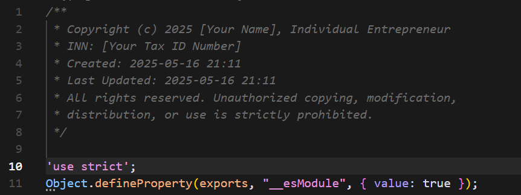

# Copyright Notice Generator

[](https://marketplace.visualstudio.com/items?itemName=bivex.copyright-notice)
[](https://marketplace.visualstudio.com/items?itemName=bivex.copyright-notice)
[](https://marketplace.visualstudio.com/items?itemName=bivex.copyright-notice)

Automatically add customizable copyright notices to your code files across multiple programming languages. Perfect for ensuring proper intellectual property protection in your projects.

## ✨ What's New in v1.1.1

- 🔇 **Silent Background Operation**: Works invisibly without interrupting your workflow
- ⚡ **Smart Debouncing**: Intelligent delay management adapts to file activity levels
- 🎯 **Advanced Detection**: Improved copyright pattern recognition with confidence scoring
- 📁 **Folder Restrictions**: Control where copyright notices are applied
- 🛡️ **Comprehensive Exclusions**: Auto-excludes common build/dependency folders
- 📊 **Performance Optimized**: Smart caching and configurable delays for smooth operation
- 🔧 **Configurable Timing**: Customize delays and behavior to match your workflow
- 📈 **Enhanced Diagnostics**: Built-in testing and analysis tools



## Key Features

- ✨ **Automatic Background Insertion**: Silently adds copyright notices to new files in the background
- 🔄 **Manual Command**: Apply notice on demand with the Command Palette
- 😀 **Emoji Removal**: Remove all emojis from files with a single command
- 🌐 **Multi-language Support**: Works with all programming languages
- 📝 **Customizable Templates**: Use your own copyright text with dynamic year insertion
- 🕒 **Timestamp Support**: Include creation date and time in your notices
- 🔄 **Update Time Tracking**: Automatically updates the "last modified" timestamp
- 🔍 **Smart Detection**: Avoids duplicate notices with advanced pattern recognition
- 🧩 **File Extension Filtering**: Target specific file types
- 📁 **Folder Restrictions**: Control where copyright notices are applied
- 🛡️ **Smart Exclusions**: Auto-excludes common build/dependency folders (node_modules, .git, dist, etc.)
- 🧠 **Intelligent Debouncing**: Adapts delay based on file activity for optimal performance
- 🔇 **Silent Mode**: Works invisibly in the background without notifications
- ⚡ **Performance Optimized**: Smart caching and configurable delays for smooth operation
- 📊 **Advanced Diagnostics**: Comprehensive analysis and detailed reporting

## How It Works

### Background Operation
The extension works silently in the background, automatically adding copyright notices to new files without interrupting your workflow. When you open a file without a copyright notice, it gets added seamlessly after a configurable delay.

### Smart Detection
Uses advanced pattern recognition to detect existing copyright notices, avoiding duplicates and handling various comment formats across different programming languages.

### Multiple Trigger Points
- **File Opening**: Automatically processes files when first opened
- **Typing Pauses**: Adds copyright during editing after configurable delay
- **Smart Debouncing**: Adapts delay based on how recently you worked with the file
- **Manual Command**: Apply notice on demand with the Command Palette (Ctrl+Shift+P)
- **Editor Switching**: Processes files when switching between editors
- **Inactive File Detection**: Immediately updates copyright when switching to long-unused files

### Emoji Management
Remove all emojis from any file using the "Remove All Emojis from File" command. This is useful for cleaning up code that contains unwanted emoji characters.

## Configuration Options

### Core Settings
- `copyright-notice.languages`: Languages that the extension will be activated for (default: all languages)
- `copyright-notice.fileExtensions`: File extensions to which the copyright notice will be applied (e.g., ['.js', '.ts', '.py']). Use ['*'] for all files.
- `copyright-notice.excludedFiles`: File patterns to exclude from copyright notices. Supports glob patterns. Defaults include common build/dependency folders like node_modules, .git, dist, build, etc.
- `copyright-notice.allowedFolders`: Comma-separated list of folder paths where copyright notices can be applied. If empty, applies to all folders. Paths can be relative to workspace root or absolute (e.g., ['src', 'lib', 'app/components']).
- `copyright-notice.template`: Copyright notice template. Use {year} for the current year, {timestamp} for creation time, and {updatetime} for last update time.

### Default Exclusions

The extension automatically excludes these common folders and files by default:
- `**/node_modules/**` - Node.js dependencies
- `**/.git/**` - Git repository data
- `**/.vscode/**` - VS Code settings
- `**/dist/**` - Distribution/build output
- `**/build/**` - Build artifacts
- `**/.next/**` - Next.js build files
- `**/.nuxt/**` - Nuxt.js build files
- `**/coverage/**` - Test coverage reports
- `**/.nyc_output/**` - NYC coverage output
- `**/*.log` - Log files
- `**/package-lock.json` - NPM lock file
- `**/yarn.lock` - Yarn lock file
- `**/.DS_Store` - macOS system files
- `**/Thumbs.db` - Windows system files

### Timestamp Configuration
- `copyright-notice.includeTimestamp`: Whether to include timestamp when the copyright notice was added (default: false).
- `copyright-notice.timestampFormat`: Format for the timestamp (default: "YYYY-MM-DD HH:mm:ss").
- `copyright-notice.includeUpdateTime`: Whether to include and update the "last updated" timestamp (default: false).
- `copyright-notice.updateTimeFormat`: Format for the update timestamp (default: "YYYY-MM-DD HH:mm:ss").

### Background Operation
- `copyright-notice.silentMode`: Whether to apply copyright changes silently in the background without showing notifications (default: true).
- `copyright-notice.backgroundUpdateDelay`: Delay in milliseconds before applying background copyright updates after typing stops (default: 1500, min: 500, max: 10000).
- `copyright-notice.smartDebouncing`: Enable smart debouncing that increases delay for files that haven't been modified recently, allowing copyright updates even for inactive files (default: true).
- `copyright-notice.smartDebounceMultiplier`: Multiplier for debounce delay when file hasn't been modified for a while (default: 2.0, min: 1.0, max: 5.0).
- `copyright-notice.smartDebounceThreshold`: Time in milliseconds after which smart debouncing activates (default: 300000 = 5 minutes).

### Additional Features
- `copyright-notice.autoRemoveEmojis`: Whether to automatically remove all emojis from files when they are saved (default: false).

## Example Settings

### JavaScript/TypeScript Development

```json
{
  "copyright-notice.languages": [
    "javascript", 
    "typescript"
  ],
  "copyright-notice.fileExtensions": [
    ".js",
    ".jsx",
    ".ts",
    ".tsx"
  ],
  "copyright-notice.template": "/**\n * Copyright (c) {year} Your Company Name\n * All rights reserved.\n */\n\n"
}
```

### With Creation and Update Timestamps

```json
{
  "copyright-notice.includeTimestamp": true,
  "copyright-notice.includeUpdateTime": true,
  "copyright-notice.template": "/**\n * Copyright (c) {year} Your Company Name\n * Created: {timestamp}\n * Last Updated: {updatetime}\n * All rights reserved.\n */\n\n"
}
```

### Custom Timestamp Formats

```json
{
  "copyright-notice.includeTimestamp": true,
  "copyright-notice.timestampFormat": "DD/MM/YYYY",
  "copyright-notice.template": "/**\n * Copyright (c) {year} Your Company Name\n * Date: {timestamp}\n * All rights reserved.\n */\n\n"
}
```

```json
{
  "copyright-notice.includeTimestamp": true,
  "copyright-notice.timestampFormat": "YYYY.MM.DD at HH:mm",
  "copyright-notice.template": "/**\n * Created on {timestamp}\n * Copyright (c) {year} Your Company Name\n * All rights reserved.\n */\n\n"
}
```

### C/C++ Development

```json
{
  "copyright-notice.languages": [
    "c",
    "cpp"
  ],
  "copyright-notice.fileExtensions": [
    ".c",
    ".cpp",
    ".h",
    ".hpp"
  ],
  "copyright-notice.template": "/**\n * Copyright (c) {year} Your Company Name\n * All rights reserved.\n */\n\n"
}
```

### Python Development

```json
{
  "copyright-notice.languages": [
    "python"
  ],
  "copyright-notice.fileExtensions": [
    ".py"
  ],
  "copyright-notice.template": "# Copyright (c) {year} Your Company Name\n# All rights reserved.\n\n"
}
```

### PHP Development

```json
{
  "copyright-notice.languages": [
    "php"
  ],
  "copyright-notice.fileExtensions": [
    ".php"
  ],
  "copyright-notice.template": "/**\n * Copyright (c) {year} Your Company Name\n * All rights reserved.\n */\n\n"
}
```

### Shell Script Development

```json
{
  "copyright-notice.languages": [
    "shellscript"
  ],
  "copyright-notice.fileExtensions": [
    ".sh",
    ".bash",
    ".zsh"
  ],
  "copyright-notice.template": "# Copyright (c) {year} Your Company Name\n# All rights reserved.\n\n"
}
```

### AutoHotkey Development (.ahk and .ahk2 files)

```json
{
  "copyright-notice.fileExtensions": [
    ".ahk",
    ".ahk2"
  ],
  "copyright-notice.excludedFiles": [
    "*.json",
    "*.config.js",
    "package.json"
  ],
  "copyright-notice.template": "/*\n * Copyright (c) {year} Your Company Name\n * All rights reserved.\n */\n\n"
}
```

**Note**: The extension now works with `.ahk2` files even if VS Code doesn't recognize the language ID. Simply add the file extension to the `fileExtensions` array.

### Silent Background Mode

```json
{
  "copyright-notice.silentMode": true,
  "copyright-notice.backgroundUpdateDelay": 1000,
  "copyright-notice.template": "/* Copyright (c) {year} Your Company */\n\n"
}
```

This configuration enables completely silent operation with copyright notices added automatically in the background with a 1-second delay after typing stops.

### Fast Interactive Mode

```json
{
  "copyright-notice.silentMode": false,
  "copyright-notice.backgroundUpdateDelay": 500,
  "copyright-notice.includeUpdateTime": true,
  "copyright-notice.template": "/**\n * Copyright (c) {year} Your Company\n * Last Updated: {updatetime}\n */\n\n"
}
```

This configuration shows notifications and applies changes quickly, with automatic timestamp updates.

### Restricted Folders Mode

```json
{
  "copyright-notice.allowedFolders": ["src", "lib", "app/components"],
  "copyright-notice.silentMode": true,
  "copyright-notice.backgroundUpdateDelay": 2000
}
```

This configuration only applies copyright notices to files in the specified folders (`src`, `lib`, and `app/components`), leaving other folders untouched.

### Smart Debouncing Mode

```json
{
  "copyright-notice.smartDebouncing": true,
  "copyright-notice.smartDebounceMultiplier": 3.0,
  "copyright-notice.smartDebounceThreshold": 600000,
  "copyright-notice.silentMode": true
}
```

This configuration enables smart debouncing with 3x delay increase for files inactive for more than 10 minutes, ensuring copyright updates even for files you haven't worked on recently.

### Custom Exclusions

```json
{
  "copyright-notice.excludedFiles": [
    "**/node_modules/**",
    "**/.git/**",
    "**/.vscode/**",
    "**/dist/**",
    "**/build/**",
    "**/temp/**",
    "**/cache/**",
    "**/*.tmp",
    "**/*.bak"
  ]
}
```

This configuration adds custom exclusions (temp, cache, temporary files) in addition to the default exclusions.

### Individual Entrepreneur / Sole Proprietor

```json
{
  "copyright-notice.includeTimestamp": true,
  "copyright-notice.includeUpdateTime": true,
  "copyright-notice.template": "/**\n * Copyright (c) {year} [Your Name], Individual Entrepreneur\n * INN: [Your Tax ID Number]\n * Created: {timestamp}\n * Last Updated: {updatetime}\n * All rights reserved. Unauthorized copying, modification,\n * distribution, or use is strictly prohibited.\n */\n\n"
}
```

## Additional Template Examples

The extension comes with a variety of pre-configured templates for different scenarios, including:

- Corporate templates (standard and detailed)
- Individual templates (sole proprietor, freelancer)
- Open source license templates (MIT, GPL)
- Language-specific templates (Python, HTML, Shell)

See the [template-examples.json](https://github.com/bivex/bivex.copyright-notice-0.1.0/blob/main/template-examples.json) file for a complete list of examples that you can copy into your configuration.

## Performance & Background Operation

### Smart Caching
The extension uses intelligent caching to optimize performance:
- File analysis results are cached for 30 seconds
- Files with existing copyright are processed faster
- Reduces unnecessary re-analysis during editing

### Configurable Delays
- **Background Update Delay**: Configurable pause before applying changes (500-10000ms)
- **Smart Debouncing**: Automatically adjusts delay based on file activity (1x-5x multiplier)
- **Debounced Processing**: Prevents excessive processing during rapid typing
- **Optimized Timing**: Balances responsiveness with performance for different file types

### Silent Operation
- **Zero Interruptions**: Works invisibly in the background
- **No Notifications**: Unless explicitly configured otherwise
- **Seamless Integration**: Doesn't interfere with your workflow

## Why Use Copyright Notices?

Adding copyright notices to your source code:
- Establishes ownership of intellectual property
- Helps with licensing compliance
- Makes attribution clear in open-source projects
- Provides legal protection for your code

## Installation

### From VS Code Marketplace
1. Open VS Code
2. Go to Extensions (Ctrl+Shift+X)
3. Search for "Copyright Notice Generator"
4. Click Install

### From VSIX File
1. Download the `.vsix` file from the [Releases](https://github.com/bivex/bivex.copyright-notice-0.1.0/releases) page
2. In VS Code, go to Extensions (Ctrl+Shift+X)
3. Click the "..." menu and select "Install from VSIX..."
4. Choose the downloaded `.vsix` file

### Building from Source
```bash
# Clone the repository
git clone https://github.com/bivex/bivex.copyright-notice-0.1.0.git
cd bivex.copyright-notice-0.1.0

# Install dependencies
npm install

# Package the extension
npm run package:win    # Windows
npm run package:unix   # Unix/Linux/macOS
# or
npm run package        # Direct vsce command
```

See [scripts/README.md](scripts/README.md) for detailed packaging instructions.

## Testing & Diagnostics

The extension includes comprehensive testing tools for validation:

```bash
# Run background mode tests
node tests/background_mode_test.cjs

# Run smart debouncing tests
node tests/smart_debouncing_test.cjs

# Run diagnostic analysis
node tests/diagnostic_test.cjs

# Run pattern recognition tests
node tests/pattern_test.cjs

# Run exclusions demonstration
node tests/simple_exclusions_demo.cjs
```

### Diagnostic Features
- **File Analysis**: Comprehensive copyright detection analysis
- **Configuration Validation**: Settings verification
- **Performance Monitoring**: Cache and timing diagnostics
- **Error Reporting**: Detailed error analysis and reporting

## Requirements

### For Users
No additional requirements or dependencies needed.

### For Developers
- Node.js (https://nodejs.org/)
- npm or yarn
- VS Code Extension Development Host (included with VS Code)

## Known Issues

None currently reported. The extension has been thoroughly tested with comprehensive diagnostics and performance optimizations.

### Troubleshooting
If you encounter issues:
1. Check VS Code developer console (Help → Toggle Developer Tools)
2. Run diagnostic tests: `node tests/diagnostic_test.cjs`
3. Verify your configuration settings
4. Ensure VS Code is updated to the latest version

Please submit issues on our [GitHub repository](https://github.com/bivex/bivex.copyright-notice-0.1.0/issues).

## Release Notes

### 1.1.1

Major performance and usability improvements:
- **Added**: Silent background mode for unobtrusive operation
- **Added**: Smart debouncing with adaptive delay management
- **Added**: Folder restriction controls for targeted application
- **Added**: Comprehensive default exclusions (node_modules, .git, dist, etc.)
- **Added**: Inactive file detection for immediate copyright updates
- **Added**: Configurable background update delay (500-10000ms)
- **Added**: Smart caching system for improved performance
- **Added**: Advanced document opening handler
- **Improved**: Copyright detection with confidence scoring
- **Improved**: Comprehensive file state analysis
- **Fixed**: Module loading issues for better VS Code compatibility
- **Added**: Detailed diagnostic and testing tools

### 1.0.1

Bug fixes and new features:
- **Fixed**: `.ahk2` files now work properly even if VS Code doesn't recognize the language ID
- **Added**: File exclusion patterns to prevent copyright notices on specific files (e.g., `*.json`)
- **Improved**: Extension now works if EITHER language ID OR file extension is enabled (not both required)
- **Added**: Support for glob patterns in file exclusions

### 1.0.0

Full release with multiple improvements:
- Added timestamp support for creation and update times
- Added manual command to apply copyright notices
- Added file extension filtering
- Multiple predefined templates
- Improved formatting and error handling

### 0.1.0

Initial preview release 
